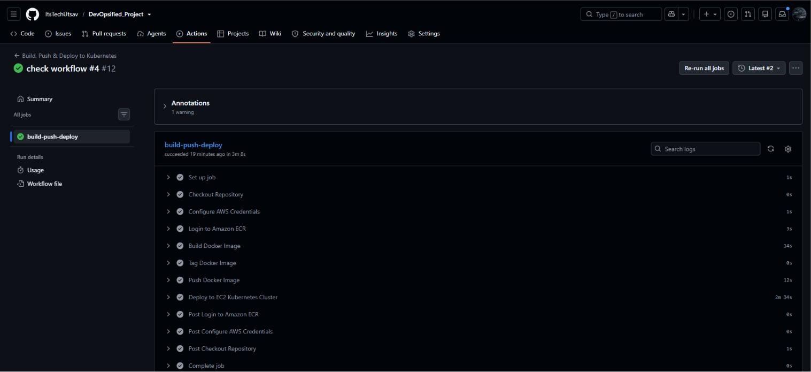
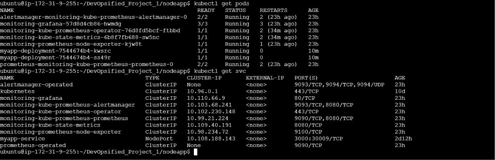
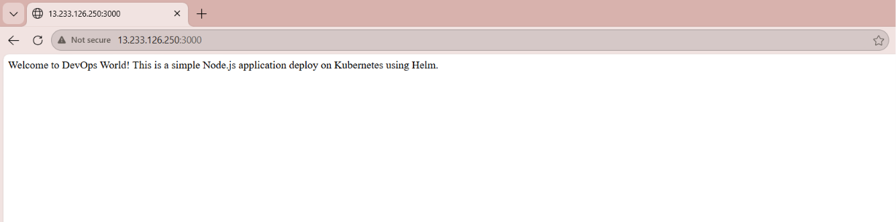
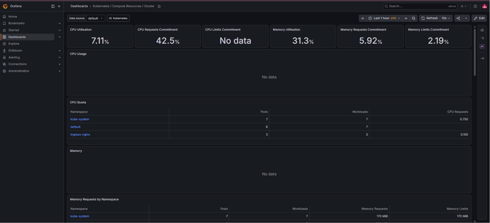

# 🚀 End-to-End DevOps CI/CD Pipeline using Docker, Kubernetes, Helm & GitHub Actions

An end-to-end DevOps project that automates the deployment of a containerized Node.js application on Kubernetes using Docker, Amazon ECR, Helm, and GitHub Actions.

The project demonstrates a complete CI/CD workflow—from writing code to automatically building Docker images, pushing them to Amazon ECR, and deploying the latest version to a Kubernetes cluster using Helm.

---

# 📌 Why I Built This Project

Deploying applications manually is time-consuming and error-prone.

The goal of this project was to understand how modern DevOps teams automate software delivery using containers, Kubernetes, CI/CD pipelines, and monitoring tools.

This project helped me gain hands-on experience with real-world deployment workflows instead of only running applications locally.

---

# 🛠️ Tech Stack

- Node.js
- Docker
- Amazon ECR
- Kubernetes
- Helm
- GitHub Actions
- NGINX Ingress
- Prometheus
- Grafana
- AWS EC2
- Minikube

---

# 🏗️ Architecture

```text
Developer
     │
     ▼
GitHub Repository
     │
     ▼
GitHub Actions
(Build & Push Docker Image)
     │
     ▼
Amazon ECR
     │
     ▼
Helm Upgrade
     │
     ▼
Kubernetes Cluster
     │
 ┌─────────────┐
 │ Deployment  │
 └─────────────┘
     │
     ▼
 Service
     │
     ▼
NGINX Ingress
     │
     ▼
Application

Prometheus
     │
     ▼
Grafana Dashboard
```

---

# ⚙️ CI/CD Workflow

1. Developer pushes code to GitHub.
2. GitHub Actions automatically builds the Docker image.
3. The image is pushed to Amazon ECR.
4. GitHub Actions connects to the Kubernetes server.
5. ECR credentials are refreshed automatically.
6. Helm upgrades the application deployment.
7. Kubernetes pulls the latest Docker image.
8. The updated application becomes available without manual deployment.

---

# ✨ Features

- Dockerized Node.js application
- Automated Docker image build
- Private image storage using Amazon ECR
- Kubernetes Deployment & Service
- Helm chart for reusable deployments
- Automated CI/CD using GitHub Actions
- NGINX Ingress configuration
- Prometheus & Grafana monitoring
- Automatic ECR authentication refresh
- Rolling updates using Kubernetes

---

# 📂 Project Structure

```
.
├── .github/
│   └── workflows/
│       └── ci-cd.yml
├── nodeapp/
│   ├── templates/
        ├── deployment.yml
        ├── service.yml
│   ├── Chart.yaml
│   └── values.yaml
├── Dockerfile
├── index.js
└── package.json
```

---

# 📸 Screenshots

## GitHub Actions Pipeline



---

## Kubernetes Deployment



---

## Application Running



---

## Grafana Dashboard



---

# 📚 What I Learned

During this project, I learned how to:

- Containerize applications using Docker
- Push private images to Amazon ECR
- Deploy applications on Kubernetes
- Package Kubernetes resources using Helm
- Build CI/CD pipelines using GitHub Actions
- Configure NGINX Ingress
- Monitor Kubernetes using Prometheus & Grafana
- Troubleshoot real deployment issues such as ImagePullBackOff, private ECR authentication, and rollout failures

---

# 🚀 Future Improvements

- Deploy on Amazon EKS instead of Minikube
- Configure a custom domain using Route 53
- Enable HTTPS with Let's Encrypt
- Replace SSH deployment with GitOps using ArgoCD
- Provision infrastructure using Terraform

---

# 👨‍💻 Author

**Utsav**

Feel free to connect or suggest improvements.
